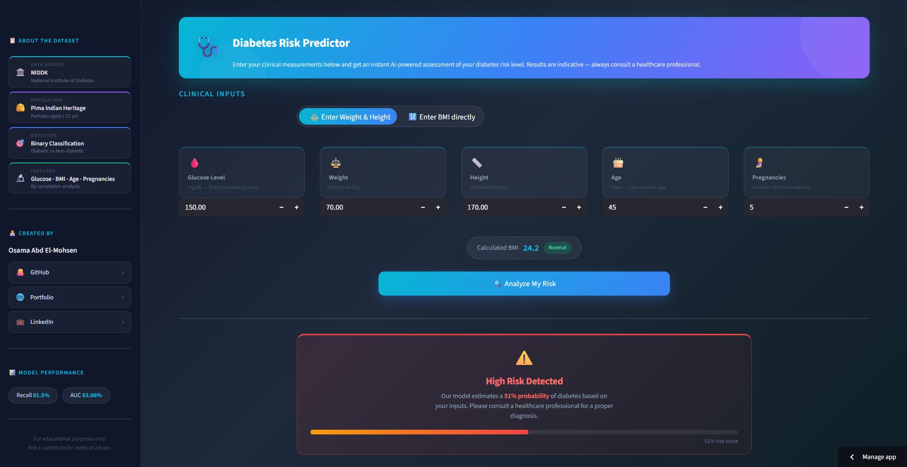

# 🩺 Diabetes Risk Predictor - ML



> A machine learning application for predicting diabetes risk based on medical diagnostic measurements using advanced classification models.

---

## 📋 Table of Contents

- [🩺 Diabetes Risk Predictor - ML](#-diabetes-risk-predictor---ml)
  - [📋 Table of Contents](#-table-of-contents)
  - [🎯 Project Overview](#-project-overview)
  - [✨ Key Features](#-key-features)
  - [📊 Dataset](#-dataset)
  - [🤖 Model Performance](#-model-performance)
    - [Model Comparison](#model-comparison)
  - [📒 Notebooks](#-notebooks)
  - [📁 Project Structure](#-project-structure)
  - [🚀 Installation \& Usage](#-installation--usage)
    - [Prerequisites](#prerequisites)
    - [Setup Instructions](#setup-instructions)
    - [Notebooks](#notebooks)
  - [💻 Technologies](#-technologies)
  - [📊 Pipeline Architecture](#-pipeline-architecture)
  - [🎓 Why Random Forest?](#-why-random-forest)
  - [ℹ️ For More Details](#ℹ️-for-more-details)
  - [👤 Author](#-author)
    - [Feedback \& Contributions](#feedback--contributions)

---

## 🎯 Project Overview

Predicts diabetes risk from 4 medical measurements using Random Forest with 81.5% Recall and 83% AUC. Prioritizes early detection to minimize missed diagnoses.

**Dataset**: National Institute of Diabetes and Digestive and Kidney Diseases | **Population**: Females 21+ of Pima Indian heritage | **Samples**: 768

---

## ✨ Key Features

- 🎯 **Web Interface**: Interactive Streamlit app for predictions
- 📊 **Full Analysis**: EDA with feature correlations, distributions, outlier detection
- 🤖 **Model Comparison**: Logistic Regression, Decision Tree, Random Forest
- 🔧 **Optimized**: Hyperparameter tuning and threshold optimization (0.35)
- 📈 **Strong Metrics**: 81.5% Recall, 83% AUC

---

## 📊 Dataset

- **Size**: 768 samples, 8 features
- **Target**: Outcome (1 = Diabetic, 0 = Non-diabetic)  
- **Class Distribution**: ~35% diabetic, ~65% non-diabetic (mild imbalance)
- **Features Used**: Glucose, BMI, Age, Pregnancies (top 4 correlates)
- **Preprocessing**: RobustScaler for outlier resistance, balanced class weights

See [01_EDA.ipynb](notebooks/01_EDA.ipynb) for detailed data analysis.

---

## 🤖 Model Performance

### Model Comparison

| Model | Recall | AUC | F1-Score | Status |
|-------|--------|-----|----------|--------|
| **Random Forest** ⭐ | **81.5%** | **83.06%** | **0.68** | **Selected** |
| Decision Tree | 77.5% | 81.2% | 0.64 | Baseline |
| Logistic Regression | 75.2% | 79.8% | 0.61 | Baseline |

**Threshold**: 0.35 (optimized for higher recall to minimize missed diagnoses)

See [02_Modeling.ipynb](notebooks/02_Modeling.ipynb) for hyperparameter tuning, ROC curves, and feature importance.

---

## 📒 Notebooks

- **[01_EDA.ipynb](notebooks/01_EDA.ipynb)**: Feature distributions, correlations, outlier detection, class balance analysis
- **[02_Modeling.ipynb](notebooks/02_Modeling.ipynb)**: Model comparison (Logistic Regression, Decision Tree, Random Forest), hyperparameter tuning, ROC curves, feature importance

---

## 📁 Project Structure

```
Diabetes Risk Predictor/
├── 📄 README.md                      # Project documentation
├── 📱 app/
│   ├── app.py                        # Streamlit web application
│   └── requirements.txt              # Python dependencies
├── 📊 data/
│   ├── diabetes.csv                  # Original dataset
│   └── clean_diabetes_data.csv       # Preprocessed data
├── 🤖 model/
│   └── diabetes_pipeline.pkl         # Trained Random Forest pipeline
├── 📓 notebooks/
│   ├── 01_EDA.ipynb                  # Exploratory Data Analysis
│   ├── 02_Modeling.ipynb             # Model Development & Comparison
│   └── utils.py                      # Utility functions
└── 🎨 assets/
    └── web_app.png                   # App screenshot
```

---

## 🚀 Installation & Usage

### Prerequisites
- Python 3.8+
- pip or conda package manager

### Setup Instructions

1. **Clone or download the project**
   ```bash
   cd "Diabetes Risk Predictor"
   ```

2. **Install dependencies**
   ```bash
   pip install -r app/requirements.txt
   ```

3. **Run the Streamlit app**
   ```bash
   streamlit run app/app.py
   ```

4. **Access the application**
   - Opens in your web browser (typically http://localhost:8501)
   - Enter patient information to get diabetes risk prediction

### Notebooks

To explore the analysis and modeling process:

```bash
jupyter notebook notebooks/01_EDA.ipynb
jupyter notebook notebooks/02_Modeling.ipynb
```

---

## 💻 Technologies

**ML & Data**: pandas, numpy, scikit-learn  
**Visualization**: matplotlib, seaborn  
**Web**: Streamlit, joblib  
**Language**: Python 3.8+

---

## 📊 Pipeline Architecture

```
Input (4 features) → RobustScaler → Random Forest Classifier → Threshold 0.35 → Prediction
```

---

## 🎓 Why Random Forest?

- **Highest Recall (81.5%)**: Catches most diabetic patients
- **Strong AUC (83.06%)**: Excellent discrimination ability
- **Balanced Performance**: F1-Score of 0.68 maintains good precision-recall trade-off
- **Interpretability**: Feature importance provides actionable insights
- **Robustness**: Handles outliers and scaling issues effectively

---

## ℹ️ For More Details

Refer to Jupyter notebooks for detailed analysis:
- **[01_EDA.ipynb](notebooks/01_EDA.ipynb)** - Data exploration
- **[02_Modeling.ipynb](notebooks/02_Modeling.ipynb)** - Model development

**Developed by**: Osama Mohamed Abd El-Mohsen  
**Role**: Machine Learning & Data Science  

---

## 👤 Author
- 🔗 **Portfolio**: [osama-abd-elmohsen-portfolio.me](https://www.osama-abd-elmohsen-portfolio.me)
- 💻 **GitHub**: [@Osama-Abd-El-Mohsen](https://github.com/Osama-Abd-El-Mohsen)

### Feedback & Contributions
Found issues or have suggestions? Contributions and feedback are welcome!

---

**Status**: ✅ Production Ready | **Version**: 1.0